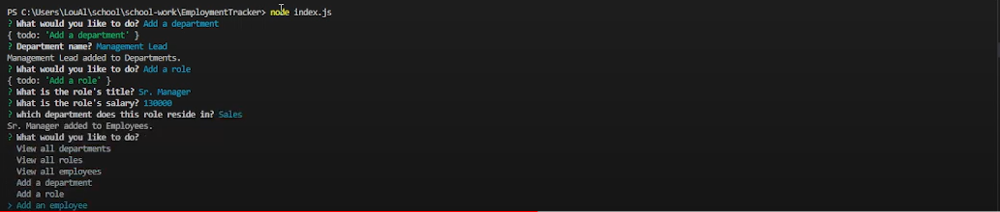

# EmploymentTracker
## Table of Contents

1. [Description](#description)
2. [Deployment](#deployment)
3. [Video Demo](#video-demo)

## Description
This is an application that uses Node.js. It fully allows the user to track new and existing employee's working at a company using a MySQL database. They are able to add new or edit exisiting departments, roles and salaries.

## Deployment

[Repo](https://github.com/Undrcver/EmploymentTracker)

## Video Demo

[Live Demo](https://www.youtube.com/watch?v=RTjOUz9qhco&ab_channel=Undrcver)
